<div align="center">

# 🦈 PacketChef MCP
### Zero-Dependency Network Forensics & PCAP Protocol Dissection Engine for AI Agents

[](https://packet-chef-e9d4aqbcf3ggf2hx.eastasia-01.azurewebsites.net/)
[](https://www.npmjs.com/package/@noorfatima123456/packet-chef-mcp)
[](https://smithery.ai/servers/noor-202401938/packet-chef-mcp)
[](https://glama.ai/mcp/servers/noor202401938-netizen/packet-chef-mcp)

[](LICENSE)
[](package.json)
[](package.json)
[](test.js)
[-purple.svg?style=flat-square)](#-empirical-claims-audit--verification)

**A pure-JavaScript Model Context Protocol (MCP) server that empowers autonomous AI agents (Claude Code, Cursor, Windsurf, Codex, Strix) to dissect PCAP/PCAPng packet captures, reassemble TCP streams, hunt C2 beacons, detect DNS tunneling, and fingerprint TLS handshakes without native toolchains.**

[🌐 Live Cloud Dashboard](https://packet-chef-e9d4aqbcf3ggf2hx.eastasia-01.azurewebsites.net/) • [⚡ Remote SSE Endpoint](https://packet-chef-e9d4aqbcf3ggf2hx.eastasia-01.azurewebsites.net/sse) • [📦 NPM Package](https://www.npmjs.com/package/@noorfatima123456/packet-chef-mcp) • [📜 MCP Server Card](https://packet-chef-e9d4aqbcf3ggf2hx.eastasia-01.azurewebsites.net/.well-known/mcp/server-card.json) • [🤖 llms.txt](https://packet-chef-e9d4aqbcf3ggf2hx.eastasia-01.azurewebsites.net/llms.txt)

---

</div>

## 🌐 Live Cloud Deployment (Azure App Service)

PacketChef MCP is continuously hosted on Microsoft Azure with full HTTPS, SSE streaming, and discovery endpoints active:

| Endpoint | Method | URL | Description |
|:---|:---:|:---|:---|
| **Forensic Sandbox** | `GET` | [`/`](https://packet-chef-e9d4aqbcf3ggf2hx.eastasia-01.azurewebsites.net/) | Interactive web dashboard, real-time PCAP analyzer & agent configuration hub |
| **Remote MCP SSE** | `GET` | [`/sse`](https://packet-chef-e9d4aqbcf3ggf2hx.eastasia-01.azurewebsites.net/sse) | Remote Server-Sent Events MCP endpoint for cloud-connected AI agents |
| **JSON-RPC Messages** | `POST` | [`/messages`](https://packet-chef-e9d4aqbcf3ggf2hx.eastasia-01.azurewebsites.net/messages) | Bidirectional MCP JSON-RPC execution gateway |
| **Health Probe** | `GET` | [`/health`](https://packet-chef-e9d4aqbcf3ggf2hx.eastasia-01.azurewebsites.net/health) | Real-time liveness check reporting server status and tool count (`15 tools`) |
| **MCP Server Card** | `GET` | [`/.well-known/mcp/server-card.json`](https://packet-chef-e9d4aqbcf3ggf2hx.eastasia-01.azurewebsites.net/.well-known/mcp/server-card.json) | Standardized Model Context Protocol discovery catalog and schema |
| **Agent llms.txt** | `GET` | [`/llms.txt`](https://packet-chef-e9d4aqbcf3ggf2hx.eastasia-01.azurewebsites.net/llms.txt) | Compact machine-readable reference optimized for LLM reasoning ingestion |

---

## ⚡ Why PacketChef MCP?

Traditional network analysis utilities (`tshark`, `libpcap`, Python `scapy`) were designed for human network engineers, not autonomous AI agents:
1. **Toolchain Friction:** They require heavy native C/C++ libraries and Python environments that frequently fail to compile in minimal Docker containers, serverless runners, or restricted enterprise endpoints.
2. **Context Window Destruction:** Dumping raw hex bytes or verbose packet trees into LLMs consumes tens of thousands of tokens per packet, causing hallucinations, catastrophic context exhaustion, and massive API costs.

**PacketChef MCP is built from first principles as an AI-First Network Triage Sensor:**
* **Zero Native Dependencies:** 100% pure Node.js `Buffer` arithmetic. Runs cross-platform anywhere Node.js runs without root privileges or compilation.
* **Context Economy Shield:** Converts raw binary captures into compact, bounded (&lt;2KB) JSON summaries and paginated views (default 20, max 100 packets).
* **High-Signal Threat Decoders:** Dissects the top 90% of real-world cloud/web attack indicators: DNS exfiltration, HTTP verbs, TLS SNI, JA3/JA4 fingerprints, C2 beacon periodicity, WebSockets, and QUIC handshakes.
* **Dual Transport Security:** Local `stdio` mode allows local file triage (`filePath`), while remote `HTTP/SSE` mode enforces a strict filesystem jail, accepting only isolated Base64 streams (up to 10MB).

```mermaid
flowchart LR
    A[Raw .pcap / .pcapng] --> B[PacketChef Binary Dissector]
    B --> C[L2-L4 Decoder<br>Ethernet / IPv4 / IPv6 / TCP / UDP]
    C --> D[TCP Stream Reassembler<br>Out-of-Order Splicing]
    D --> E[L7 Forensic Analyzers<br>DNS / HTTP / TLS JA3-JA4 / WebSocket / QUIC]
    E --> F[Threat Detection Engine<br>C2 Beacons CV / DNS Entropy / Credentials]
    F --> G[Context Economy Shield<br>Bounded &lt;2KB JSON Reports]
    G --> H[AI Agent: Claude / Cursor / Strix]
```



---

## 🚀 Quick Start & Integration

### Option 1: Remote Azure SSE (Zero Setup Needed)

Connect your AI agent directly to the live cloud endpoint without installing any local packages:

#### In Claude Desktop (`claude_desktop_config.json`)
```json
{
  "mcpServers": {
    "packet-chef-cloud": {
      "url": "https://packet-chef-e9d4aqbcf3ggf2hx.eastasia-01.azurewebsites.net/sse"
    }
  }
}
```

#### In Cursor (`~/.cursor/mcp.json`)
```json
{
  "mcpServers": {
    "packet-chef": {
      "url": "https://packet-chef-e9d4aqbcf3ggf2hx.eastasia-01.azurewebsites.net/sse"
    }
  }
}
```

---

### Option 2: Local Stdio via NPX (Recommended for Local PCAP Files)

Run locally on your workstation for zero network latency, air-gapped security, and direct file path inspection:

#### Configuration (`claude_desktop_config.json` or `mcp.json`)
```json
{
  "mcpServers": {
    "packet-chef": {
      "command": "npx",
      "args": ["-y", "@noorfatima123456/packet-chef-mcp@latest"]
    }
  }
}
```

#### Via Claude Code CLI
```bash
claude mcp add packet-chef -- npx -y @noorfatima123456/packet-chef-mcp@latest
```

#### Via Smithery (1-Click Install)
```bash
npx -y @smithery/cli install @noor-202401938/packet-chef-mcp --client claude
```

---

## 🛠️ MCP Tools Catalog (15 Production Forensics Operations)

| Tool | Parameters | Output & Forensic Purpose |
|:---|:---|:---|
| **`packet_summary`** | `input?: string`<br>`filePath?: string` | **L3–L7 High-Density Triage:** Generates a compact (&lt;2KB JSON) capture overview: total packets, wire bytes, duration, protocol distribution, top talkers, and enterprise protocol warnings. |
| **`packet_list`** | `input?: string`<br>`filePath?: string`<br>`offset?: number`<br>`limit?: number` (max 100)<br>`protocol?: string` | **Paginated Packet Records:** Bounded metadata listing (index, timestamp, length, 5-tuple, flags) protecting LLM context from raw hex flooding. |
| **`packet_extract_conversations`** | `input?: string`<br>`filePath?: string`<br>`limit?: number` (max 200) | **5-Tuple Flow Tracker:** Bidirectional conversation flows ranked by total bytes, tracking complete TCP flag lifecycles (`SYN`, `ACK`, `FIN`, `RST`). |
| **`packet_extract_dns`** | `input?: string`<br>`filePath?: string`<br>`queryType?: string`<br>`limit?: number` (max 200) | **RFC 1035 DNS Parser:** Resolves queries and responses (A, AAAA, CNAME, TXT, MX, PTR) with pointer compression loop protection. |
| **`packet_extract_http`** | `input?: string`<br>`filePath?: string`<br>`method?: string`<br>`limit?: number` (max 100) | **HTTP/1.x Stream Reassembly:** Reassembles TCP segments and extracts HTTP verbs, URIs, response codes, headers, and 4KB body previews with cognitive triage hints. |
| **`packet_extract_tls_sni`** | `input?: string`<br>`filePath?: string`<br>`limit?: number` (max 200) | **TLS SNI Extractor:** Dissects TLS 1.0–1.3 ClientHello records to extract Server Name Indication (SNI) hostnames without decrypting payloads. |
| **`packet_detect_beacons`** | `input?: string`<br>`filePath?: string`<br>`minConnections?: number`<br>`includeBenign?: boolean` | **Statistical C2 Beacon Detector:** Computes interval time-delta variance (Coefficient of Variation, jitter %, median interval) to flag periodic Command & Control channels. Filters cloud IMDS and NTP. |
| **`packet_detect_dns_tunneling`** | `input?: string`<br>`filePath?: string`<br>`minSubdomains?: number` | **DNS Tunnel & Exfiltration Hunter:** Calculates Shannon entropy, subdomain label lengths, and character set encodings (hex/base32/base64) to detect dnscat2, iodine, and Cobalt Strike. |
| **`packet_extract_credentials`** | `input?: string`<br>`filePath?: string` | **Cleartext Credential Hunter:** Recovers credentials from HTTP Basic/Digest headers, URL query parameters, POST bodies, FTP USER/PASS, and SMTP AUTH. |
| **`packet_entropy`** | `input?: string`<br>`filePath?: string`<br>`packetIndex?: number` | **Shannon Entropy Evaluator:** Evaluates payload randomness (0.0 to 8.0 bits/byte) to separate plaintext, structured code, and compressed/encrypted malware. |
| **`packet_ja3_fingerprints`** | `input?: string`<br>`filePath?: string`<br>`limit?: number` (max 200) | **JA3, JA3S & JA4 TLS Fingerprinting:** Computes MD5 and JA4 fingerprints with RFC 8701 GREASE filtering and malware attribution profiles. |
| **`packet_extract_websocket`** | `input?: string`<br>`filePath?: string`<br>`limit?: number` (max 200) | **RFC 6455 WebSocket Unmasker:** Reassembles TCP streams and unmasks client-to-server frames using 4-byte XOR keys with automatic JSON detection. |
| **`packet_extract_quic_sni`** | `input?: string`<br>`filePath?: string`<br>`limit?: number` (max 200) | **RFC 9000 QUIC / HTTP3 Parser:** Decodes UDP 443 Initial Handshake packets and extracts TLS 1.3 SNI hostnames, ALPN, and Connection IDs. |
| **`packet_filter_export`** | `input?: string`<br>`filePath?: string`<br>`filterIp?: string`<br>`filterPort?: number`<br>`filterProtocol?: string` | **PCAP Slicer & Exporter:** Filters packets by IP, port, or protocol and serializes the slice into a standardized classic PCAP binary. |
| **`packet_to_zeek_logs`** | `input?: string`<br>`filePath?: string`<br>`logTypes?: string[]` | **Zeek TSV Exporter:** Generates standardized Zeek TSV logs (`conn.log`, `dns.log`, `http.log`) ready for SIEM ingestion (Splunk, Elastic, Wazuh). |

---

## 🔬 Empirical Claims Audit & Verification

PacketChef MCP was evaluated against a strict 20-point empirical verification suite with raw wire bytes, corrupted buffers, encrypted packets, and adversarial inputs:

```
================================================================================
🏁 EMPIRICAL CLAIMS AUDIT: 11/11 PACKETCHEF CLAIMS VERIFIED (100% PASS RATE)
================================================================================
[P1]  Zero Native Dependencies       ✅ Pure JS Buffer arithmetic (0 node-gyp bindings)
[P2]  PCAP & PCAPng Dual Support     ✅ Parsed Classic PCAP (0xa1b2c3d4) & PCAPng (SHB/IDB/EPB)
[P3]  L2-L4 Dissection Accuracy      ✅ Wire-accurate Ethernet, IPv4, TCP flags (SYN/ACK), UDP
[P4]  TCP Stream Reassembly          ✅ Reassembled 23 bytes from shuffled segments [1, 3, 2]
[P5]  Statistical C2 Beaconing       ✅ Detected beaconing via CV algorithm (CV=0.0081 < 0.15)
[P6]  DNS Tunneling Detection        ✅ Flagged exfiltration domain via Shannon entropy (4.28 bits)
[P7]  TLS Fingerprints (JA3 / JA4)   ✅ Calculated JA3 & JA4 with RFC 8701 GREASE filtering
[P8]  RFC 6455 WebSocket De-masking  ✅ Unmasked 4-byte XOR client frame to valid JSON message
[P9]  RFC 9000 QUIC / HTTP/3         ✅ Extracted DCID & tokens from Initial Handshake packet
[P10] Truth-in-Triage Envelope       ✅ Accurately reported unparsed SMB without silent false negatives
[P11] Crash Immunity (Fuzzing)       ✅ Processed 100 malformed byte frames with 0 unhandled crashes
```

---

## 🛡️ Architectural Boundaries & Truth-in-Triage

| Feature | Supported in PacketChef MCP v2.0 | Architectural Boundary (Out of Scope) | Recommended Deep Tool |
|:---|:---|:---|:---|
| **Capture Formats** | Classic PCAP (`.pcap`), native PCAPng (`.pcapng` with SHB, IDB, EPB, SPB) | Multi-gigabyte continuous packet capture rings | `mergecap` / `editcap` |
| **Link Layers** | Ethernet II, Linux Cooked SLL (`113`), BSD/Linux Loopback (`0`), Raw IP (`12`) | 802.11 Radiotap, ZigBee, CAN bus, Cellular radio frames | `tshark` / `aircrack-ng` |
| **Network Layers** | IPv4, IPv4 Defragmentation (RFC 791), IPv6 (`::` zero-compression), IPv6 Ext 44 Fragment Guard | SCTP, IPsec ESP payload decryption | `tshark` / `snort` |
| **Enterprise Protocols** | DNS, HTTP/1.x, TLS 1.0–1.3 ClientHello, WebSocket, QUIC v1 Initial | SMB, Kerberos, DCE/RPC — **transparently reported via Truth-in-Triage envelope** | `wireshark` / `zeek` |
| **Memory Capacity** | Max 10MB Base64, max 500MB local file, **32MB global stream reassembly ceiling** | Multi-gigabyte captures (&gt;500MB) exceeding V8 memory limits | `zeek` / `tshark -Y` |

---

## 🧪 Running the Test Suite

Run the full automated test suite (94 unit, integration, and fuzz tests):

```bash
git clone https://github.com/noor202401938-netizen/packet-chef-mcp.git
cd packet-chef-mcp
npm install
npm test
```

---

## 🏷️ Discoverability Tags & Keywords

`mcp`, `mcp-server`, `packet-chef`, `packet-chef-mcp`, `pcap`, `pcapng`, `packet-analysis`, `network-forensics`, `modelcontextprotocol`, `cybersecurity`, `agentic-ai`, `claude`, `cursor`, `windsurf`, `strix`, `ja3`, `ja4`, `c2-detection`, `dns-tunneling`, `quic`, `websocket`, `threat-hunting`, `incident-response`, `siem`, `zeek`, `azure-app-service`.

---

## 📄 License

Apache-2.0 © 2026 Noor Fatima
